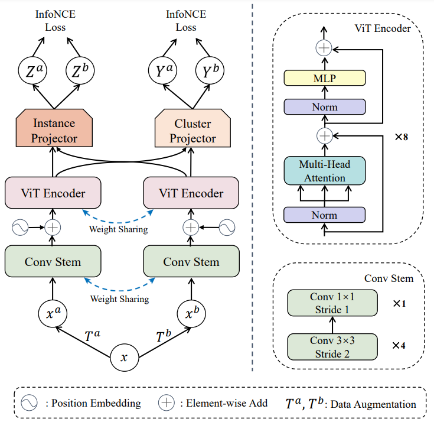

# Vision Transformer for Contrastive Clustering

This is the code for the paper "[Vision Transformer for Contrastive Clustering](https://arxiv.org/abs/2206.12925)".

<div align=center></div>


## Requirements

The code was trained on Ubuntu 18.04, including:
- python==3.7
- pytorch==1.7.0
- torchvision==0.8.0
- CUDA==11.0
- timm==0.5.4
- scikit-learn==1.0.1
- opencv-python==4.5.1
- pyyaml==6.0
- numpy==1.21.2


## Getting Started

0. [Optional but recommended] create a new conda environment

   ```
   conda create -n VTCC python=3.7
   ```

   And activate the environment
   
   ```
   conda activate VTCC
   ```

1. Clone this repository:

   ```
   git clone https://github.com/JackKoLing/VTCC.git
   ```

2. Install necessary packages (other common packages installed if need):

   ```
   pip install torch==1.7.0 torchvision==0.8.0 opencv-python==4.5.1 timm==0.5.4 scikit-learn==1.0.1 numpy pyyaml
   ```


## Data Preparation

Eight datasets can be downloaded from the url provided by their corresponding papers or official websites.


### Dataset Structure:

Make sure to put the files in the following structure:

```
|-- datasets
|   |-- RSOD
|   |-- UC-Merced
|   |-- ...
```


## Configuration

There is a configuration file "config/config.yaml", where one can edit both the training and test options.

## Training

After setting the configuration, to start training, simply run
```
python train.py
```

## Test

Once the training is completed, there will be a saved model in the "model_path" specified in the configuration file. To test the trained model, run

```
python cluster.py
```


# Citation

If you find VTCC useful in your research, please consider citing:
```
@article{ling2022vision,
  title={Vision Transformer for Contrastive Clustering},
  author={Ling, Hua-Bao and Zhu, Bowen and Huang, Dong and Chen, Ding-Hua and Wang, Chang-Dong and Lai, Jian-Huang},
  journal={arXiv preprint arXiv:2206.12925},
  year={2022}
}
```

## Acknowledge
The code is developed based on the architecture of [CC](https://github.com/XLearning-SCU/2021-AAAI-CC) and [MoCoV3](https://github.com/facebookresearch/moco-v3). We sincerely thank the authors for the excellent works!
